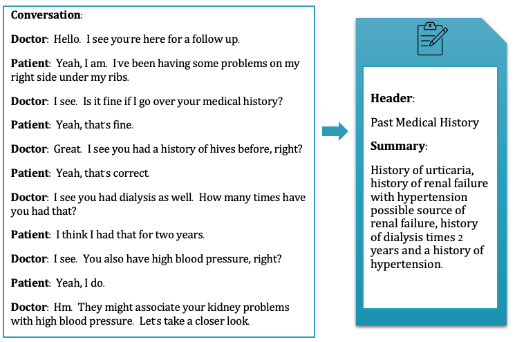
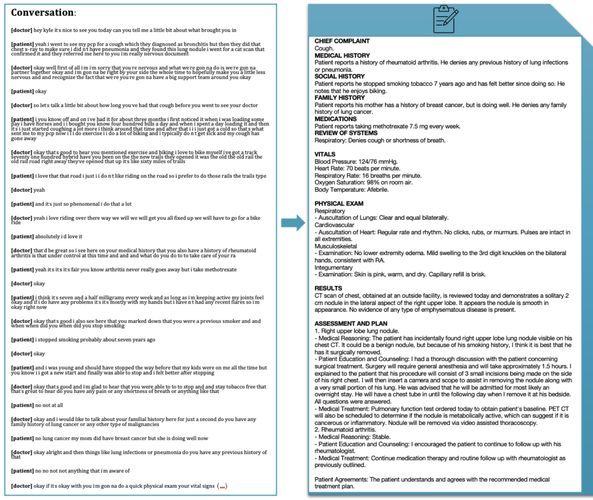

# CLINICAL VISIT NOTE SUMMARIZATION CORPUS

##  Background 
--------------------

Medical doctors spend on average 52 to 102 minutes per day writing clinical notes from their patient encounters. This task includes documenting the discussions of the visit as well as inputting accurate diagnosis and problem codes, test, and treatment orders. Although a critical instrument for healthcare delivery and an important part of medical billing and legal data, this documentation burden--an unintended consequence of electronic medical record implementation as part of the 2009 HITECH Act--has led to physician fatigue and burn-out.

Medical scribes which may cost up to $112k annually depending on specialty and institution, are one solution to the problem, however the high degree of required specialized training and attrition rates in the field make this solution challenging to maintain. With the advent of advanced speech-to-text and large language model language generation, automatic note generation may be one possible solution to alleviate the note creation burden. 

However, datasets in this area are scarce and highly protected as there are critical legal and ethical challenges related to recording, saving, and releasing patient-clinician conversations as well as their corresponding clinical note and health data. The purpose of this corpus is to provide a common dataset for the task of automatic clinical note creation from clinician-patient visit dialogue.  The technology developed from this work can be used to de-burden physicians from documentation burden, allowing them to devote more time and attention to patient care. 


##  Introduction 
--------------------
This corpus includes textual data corresponding to synthetic clinical encounters, including each encounters’ dialogue transcript, clinical note, and metadata such as patient name, age, and chief and secondary complaints. The purpose of this dataset is to be used for testing natural language generation and language generation evaluation methods for the task of clinical note generation from doctor-patient dialogue.


This corpus is comprised of two subcollections: (1) the MTS-Dialog dataset and (2) the ACI-Bench dataset. The former includes short-text dialogue and clinical note section header and text. The latter includes full visit dialogue and full clinical note text, along with accompanying metadata such as patient age, name, and gender. The data here is synthetic and created with the contributions of medical annotators and clinicians. 


The data here was the subject of two international research challenges: (1) the MEDIQA-CHAT 2023 challenge part of CLINICALNLP at ACL, and (2) the MEDIQA-SUM 2023 challenge as part of CLEF 2023. 
- MEDIQA-CHAT 2023 @ ACL CLINICALNLP: https://sites.google.com/view/mediqa2023/clinicalnlp-mediqa-chat-2023 
- MEDIQA-SUM 2023 @ CLEF: https://www.imageclef.org/2023/medical/mediqa 


This repositiory contains static data. There will be no updates to the existing data mentioned here.
A part of this dataset (the MTS-Dialog collection) is constructed based on a dataset obtained from https://mtsamples.com/.


##  Papers 
--------------------

**MTS-Dialog**

*An Empirical Study of Clinical Note Generation from Doctor-Patient Encounters. Asma Ben Abacha, Wen-wai Yim, Yadan Fan and Thomas Lin. EACL, May 3-5, 2023, Dubrovnik, Croatia.*
https://aclanthology.org/2023.eacl-main.168/



```
@inproceedings{mts-dialog,
  title     = {An Empirical Study of Clinical Note Generation from Doctor-Patient Encounters},
    author = "Ben Abacha, Asma  and
      Yim, Wen-wai  and
      Fan, Yadan  and
      Lin, Thomas",
    booktitle = "Proceedings of the 17th Conference of the European Chapter of the Association for Computational Linguistics",
    month = may,
    year = "2023",
    address = "Dubrovnik, Croatia",
    publisher = "Association for Computational Linguistics",
    url = "https://aclanthology.org/2023.eacl-main.168",
    pages = "2291--2302"
}
```


**ACI-BENCH**

*ACI-BENCH: a Novel Ambient Clinical Intelligence Dataset for Benchmarking Automatic Visit Note Generation". Wen-wai Yim, Yujuan Fu, Asma Ben Abacha, Neal Snider, Thomas Lin, Meliha Yetisgen. Nature Scientific Data 10, 586 (2023).*
https://www.nature.com/articles/s41597-023-02487-3 



```
@article{aci-bench,
  author = {Wen{-}wai Yim and
                Yujuan Fu and
                Asma {Ben Abacha} and
                Neal Snider and Thomas Lin and Meliha Yetisgen},
  title = {ACI-BENCH: a Novel Ambient Clinical Intelligence Dataset for Benchmarking Automatic Visit Note Generation},
  journal = {Nature Scientific Data},
  year = {2023}, 
  volume = {10},
  url = {https://www.nature.com/articles/s41597-023-02487-3}
}
```


## Data statistics
--------------------

The MTS-Dialog dataset is a new collection of 1.7k short doctor-patient conversations and corresponding summaries (section headers and contents). 

```
- TRAIN: 1201
- VALIDATION: 100
- TEST1: 200 (MEDIQA-CHAT TASK A)
- TEST2: 200 (MEDIQA-SUM TASK A and B)
```

The ACI-BENCH collection consists of full doctor-patient conversations and associated clinical notes and includes the data splits from the [MEDIQA-CHAT 2023](https://sites.google.com/view/mediqa2023/clinicalnlp-mediqa-chat-2023) and [MEDIQA-SUM 2023](https://www.imageclef.org/2023/medical/mediqa) challenges: 
```
TRAIN: 67
VALID: 20
TEST1: 40 ( MEDIQA-CHAT TASK B test set )
TEST2: 40 ( MEDIQA-CHAT TASK C test set )
TEST3: 40 ( MEDIQA-SUM TASK C test set )
```


## Limitations
--------------------
While the largest open data of its kind and constructed from multiple specialties, this corpus is not representative of all possible real encounter dialogue and clinical note data. We hope this dataset can be used to promote state-of-the-art research by providing a common shareable dataset to benchmark progress. The dataset here can be used to test technology for supporting front-line health care workers by alleviating their documentation burden. 

Please see our papers for further details.


## Code
--------------------

Code related to MTS-DIALOG: https://github.com/abachaa/MTS-Dialog

Code related to ACI-BENCH: https://github.com/wyim/aci-bench


## License
--------------------

The data here is published under a Creative Commons Attribution 4.0 International Licence (CC BY).
https://creativecommons.org/licenses/by/4.0/


## Contact
--------------------

    -  Asma Ben abacha (abenabacha at microsoft dot com)
     - Wen-wai Yim (yimwenwai at microsoft dot com)

